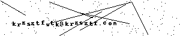

# Hi there 👋



- **BTC:** `bc1q7hsz53uzsvvzqm0tq8jdc6kj57khcwp43uq0ap`
- **ETH / ERC-20:** `0x518439aF927412a53D521b88dDfF25DEfff71cc4`
- **SOL:** `8huBuZaNzzcxhXM9KWrujwsLKgvQVpo1kqAzJ4SoGvZL`
- **TRX:** `TAueSavL38gMCK43ut5PKMNBPRpwQpPmwB`

```
-----BEGIN PGP PUBLIC KEY BLOCK-----
Comment: User ID:	krzsztfwtk
Comment: Valid from:	2026-05-09 12:47
Comment: Valid until:	2030-01-01 12:00
Comment: Type:	255-bit EdDSA (secret key available)
Comment: Usage:	Signing, Encryption, Certifying User IDs
Comment: Fingerprint:	10F9 53E1 4834 AF95 FAC2  F318 6E0E EBA2 941B 62B5


mDMEaf8QyhYJKwYBBAHaRw8BAQdAosxl9l4rfVbLzazuZRMROTxFrM7RyQTNXiaW
iDWEH1a0CmtyenN6dGZ3dGuItQQTFgoAXRYhBBD5U+FINK+V+sLzGG4O66KUG2K1
BQJp/xDKGxSAAAAAAAQADm1hbnUyLDIuNSsxLjEyLDIsMQIbAwUJBt1iZgULCQgH
AgIiAgYVCgkICwIEFgIDAQIeBwIXgAAKCRBuDuuilBtitVJ0AQCfMYyI8AQQ8djw
Svm9G1N72n0+qs/U3130+KlW6/qf1wD+PlPayLlhHj2tYhMlyKlKfp4zeL9zYvqZ
ng0IIB8WOAO4OARp/xDKEgorBgEEAZdVAQUBAQdAOj7E7gr5lEFJT31pBjYHLpq5
n2kwxczclz9dqMH3L24DAQgHiJoEGBYKAEIWIQQQ+VPhSDSvlfrC8xhuDuuilBti
tQUCaf8QyhsUgAAAAAAEAA5tYW51MiwyLjUrMS4xMiwyLDECGwwFCQbdYmYACgkQ
bg7ropQbYrUOcAEA0Iozyx4Xihx8r6K0D/NPPsz21Qj+hurvU/ZG0oHVfgsBAKJx
oLhhH0KK+y4w5OSyp29tS5WrK9YZFdirfSiyIEEE
=A4dT
-----END PGP PUBLIC KEY BLOCK-----
```

<!--
**krzsztfwtk/krzsztfwtk** is a ✨ _special_ ✨ repository because its `README.md` (this file) appears on your GitHub profile.

Here are some ideas to get you started:

- 🔭 I’m currently working on ...
- 🌱 I’m currently learning ...
- 👯 I’m looking to collaborate on ...
- 🤔 I’m looking for help with ...
- 💬 Ask me about ...
- 📫 How to reach me: ...
- 😄 Pronouns: ...
- ⚡ Fun fact: ...
-->
